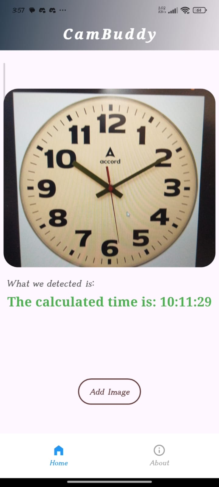
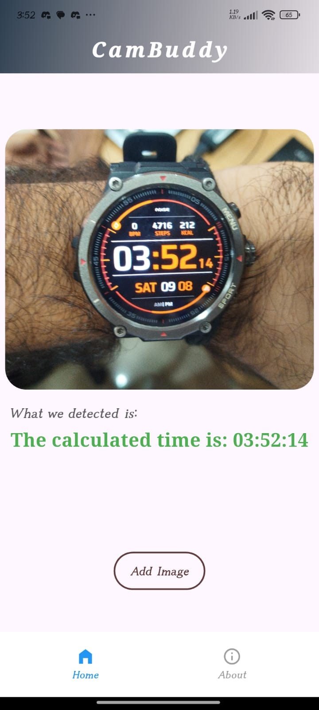

# CamBuddy 🎯

## Basic Details

### Team Name: Nameless

### Team Members

- Team Lead: Abhai Sankar P R - Sree Chitra Thirunal College of Engineering
- Member 2: Akhileswaran K R - Sree Chitra Thirunal College of Engineering

### Project Description

A fun web service that detects and returns the time shown in any uploaded clock image. Users upload a photo of a clock, and the backend extracts the exact time using AI-powered recognition.

### The Problem (that doesn't exist)

Ever tried to tell time by looking at a random photo of a clock? It’s tricky, and your brain might lie to you. Why should humans have all the fun guessing the time?

### The Solution (that nobody asked for)

We use Flask + Gemini API magic to do the heavy lifting and tell you the time from any clock image — no squinting or guessing needed. Plus, the Flutter frontend makes it a smooth, pretty experience on any device!

## Technical Details

### Technologies/Components Used

- Python
- Flask (backend server)
- Gemini API (image recognition & time extraction)
- Flutter (cross-platform frontend app)

### Implementation

# Installation

### Clone repo

```
git clone https://github.com/Akhileswaran-K-R/useless_project_temp.git  
cd backend
```

### Create virtual env & activate

```
python -m venv venv  
source venv/bin/activate
```

### Install dependencies

```
pip install -r requirements.txt
```

# Run

### Start backend server

```
gunicorn app:app
```

### Run Flutter frontend (in the frontend folder)

```
flutter run
```

### Project Documentation

# Screenshots

<p><em>Detect time from analog clock</em></p>


<p><em>Detect time from digital clock</em></p>


<p><em>Different types of inputs will be provided</em></p>


<p><em>About page</em></p>


### Project Demo

# Video

https://drive.google.com/file/d/1fQl3n3K1Y2HF-lQRYHpi-zzu9o_VcIrj/view?usp=drivesdk<br>
_This video demonstrates our CamBuddy app detecting time from both analog and digital clocks, using photos taken with the camera or selected from the gallery, showing its accuracy and ease of use._

## Team Contributions

- Abhai Sankar P R: Frontend
- Akhileswaran K R: Backend

---

Made with ❤️ at TinkerHub Useless Projects


